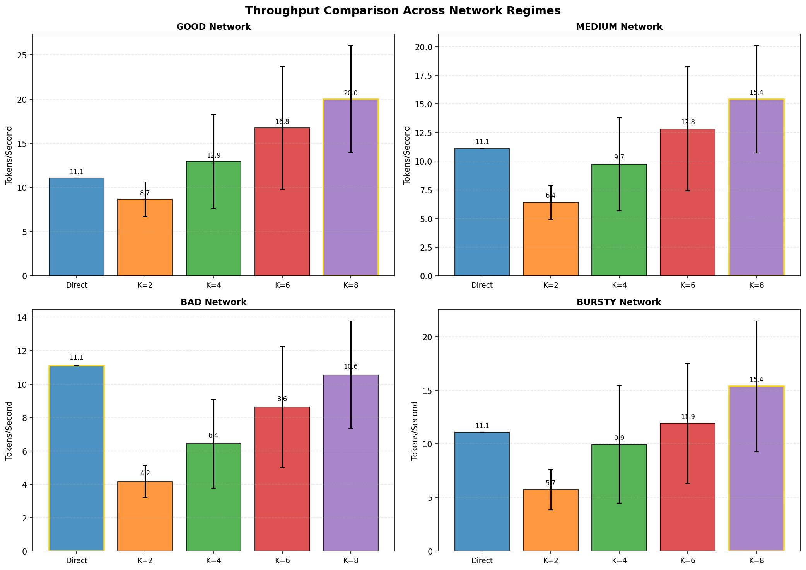
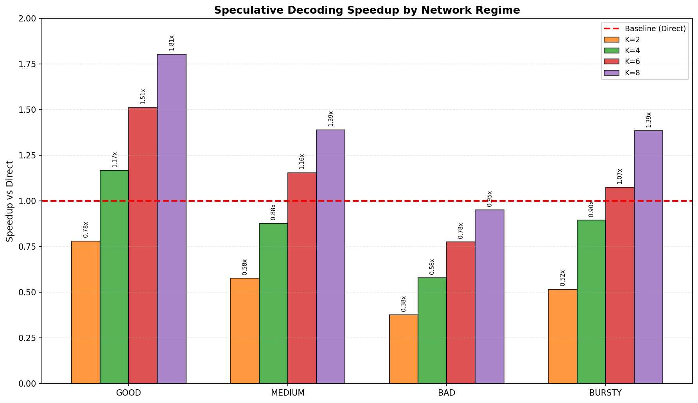
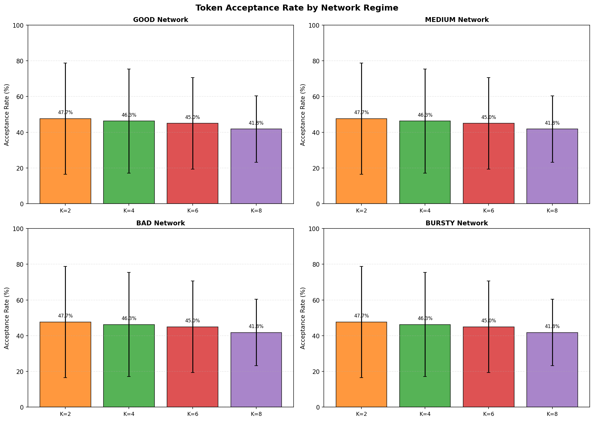
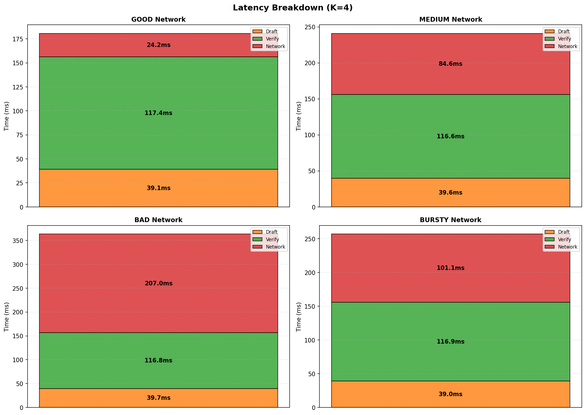
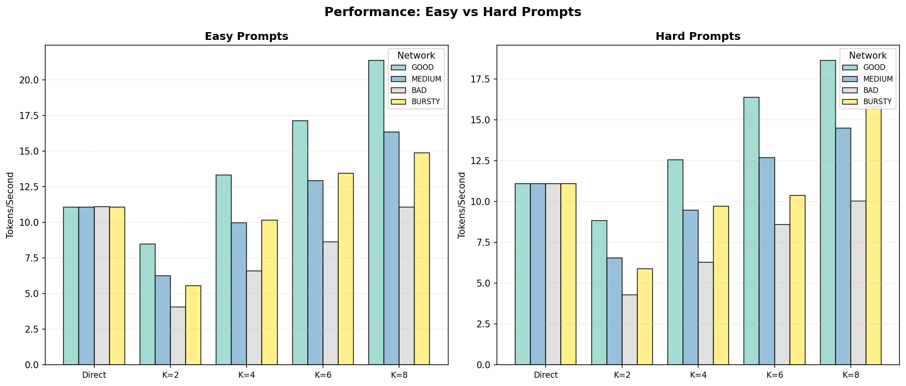

# Speculative Decoding实验报告

**实验配置**
- **时间**: 2024-04-15
- **Draft模型**: Qwen2.5-1.5B-Instruct (3GB)
- **Verify模型**: Qwen2.5-14B-Instruct-AWQ (8GB)
- **K值**: 2, 4, 6, 8
- **网络条件**: good (10ms), medium (40ms), bad (100ms), bursty (波动)
- **Prompts**: 10 easy + 10 hard, max_tokens=128
- **总测试数**: 400次

---

## 执行摘要

| 网络条件 | 最佳配置 | 吞吐量 | vs Direct |
|---------|---------|--------|-----------|
| **GOOD** | K=8 | 20.0 tok/s | +81% ⬆️ |
| **MEDIUM** | K=8 | 15.4 tok/s | +39% ⬆️ |
| **BURSTY** | K=8 | 15.4 tok/s | +39% ⬆️ |
| **BAD** | Direct | 11.1 tok/s | baseline |

**核心结论**: Good/Medium/Bursty网络下K=8最优；Bad网络下Speculative无优势。

---

## 图表分析

### 1. 吞吐量对比

**图表说明**: 展示四种网络条件下Direct与各K值的吞吐量对比。
- **Good网络**: K=8显著领先(20.0 tok/s)，是Direct的1.81倍
- **Bad网络**: 所有K值均低于Direct，网络延迟过高导致speculative overhead过大
- 金色边框标注各网络条件下的最优配置

---

### 2. 相对于Direct的加速比

**图表说明**: 红线为Direct基准(1.0x)。
- **K=2**: 在所有网络条件下均为负收益(0.38x-0.78x)
- **K=4**: Good网络开始正收益(1.17x)，Bad网络仍亏损(0.58x)
- **K=8**: Good网络收益最高(1.81x)，Bad网络接近持平(0.95x)
- **规律**: K值越大，网络条件越好，收益越高

---

### 3. Token接受率

**图表说明**: 展示各K值下draft token被verify模型接受的比例。
- **接受率范围**: 41.8% (K=8) ~ 47.7% (K=2)
- **趋势**: K值越大，接受率越低（因为draft预测更长序列，难度更大）
- **网络无关性**: 接受率在不同网络条件下几乎相同，说明主要由模型能力决定

---

### 4. 延迟分解 (K=4)

**图表说明**: 分析K=4时每次请求的延迟构成。
- **组成**: Draft时间(橙色) + Verify时间(绿色) + 网络时间(红色)
- **Bad网络**: 网络延迟占比显著增加
- 数据解释了为何Bad网络下speculative表现不佳

---

### 5. Easy vs Hard Prompts

**图表说明**: 对比简单/复杂prompt在不同网络条件下的表现。
- **Easy**: 生成容易，接受率高，各配置差异明显
- **Hard**: 推理复杂，接受率较低，但K=8在Good网络仍有优势

---

## 详细性能数据

| 网络 | 方法 | 平均TPS | 标准差 | 接受率 | 样本数 |
|-----|-----|--------|--------|--------|--------|
| GOOD | direct | 11.08 | 0.01 | - | 20 |
| GOOD | spec_k2 | 8.66 | 1.98 | 47.7% | 20 |
| GOOD | spec_k4 | 12.94 | 5.32 | 46.3% | 20 |
| GOOD | spec_k6 | 16.76 | 6.95 | 45.0% | 20 |
| GOOD | **spec_k8** | **20.01** | 6.07 | 41.8% | 20 |
| MEDIUM | direct | 11.09 | 0.00 | - | 20 |
| MEDIUM | spec_k2 | 6.40 | 1.47 | 47.7% | 20 |
| MEDIUM | spec_k4 | 9.73 | 4.05 | 46.3% | 20 |
| MEDIUM | spec_k6 | 12.81 | 5.40 | 45.0% | 20 |
| MEDIUM | **spec_k8** | **15.41** | 4.68 | 41.8% | 20 |
| BAD | direct | 11.10 | 0.00 | - | 20 |
| BAD | spec_k2 | 4.18 | 0.95 | 47.7% | 20 |
| BAD | spec_k4 | 6.43 | 2.65 | 46.3% | 20 |
| BAD | spec_k6 | 8.62 | 3.62 | 45.0% | 20 |
| BAD | spec_k8 | 10.55 | 3.22 | 41.8% | 20 |
| BURSTY | direct | 11.09 | 0.01 | - | 20 |
| BURSTY | spec_k2 | 5.73 | 1.87 | 47.7% | 20 |
| BURSTY | spec_k4 | 9.94 | 5.47 | 46.3% | 20 |
| BURSTY | spec_k6 | 11.92 | 5.60 | 45.0% | 20 |
| BURSTY | **spec_k8** | **15.37** | 6.09 | 41.8% | 20 |

---

## 部署建议

| 网络环境 | 推荐K值 | 预期加速 | 备注 |
|---------|---------|---------|------|
| **高速内网** (<20ms) | K=8 | +80% | 最优配置 |
| **普通宽带** (20-50ms) | K=8 | +40% | 仍推荐使用 |
| **弱网/跨境** (>80ms) | Direct | - | 不建议使用speculative |
| **波动网络** | K=8 | +40% | 自适应效果较好 |

---

## 附件

- `results_summary.csv` - 原始数据汇总
- `comprehensive_results.json` - 完整400条测试结果

