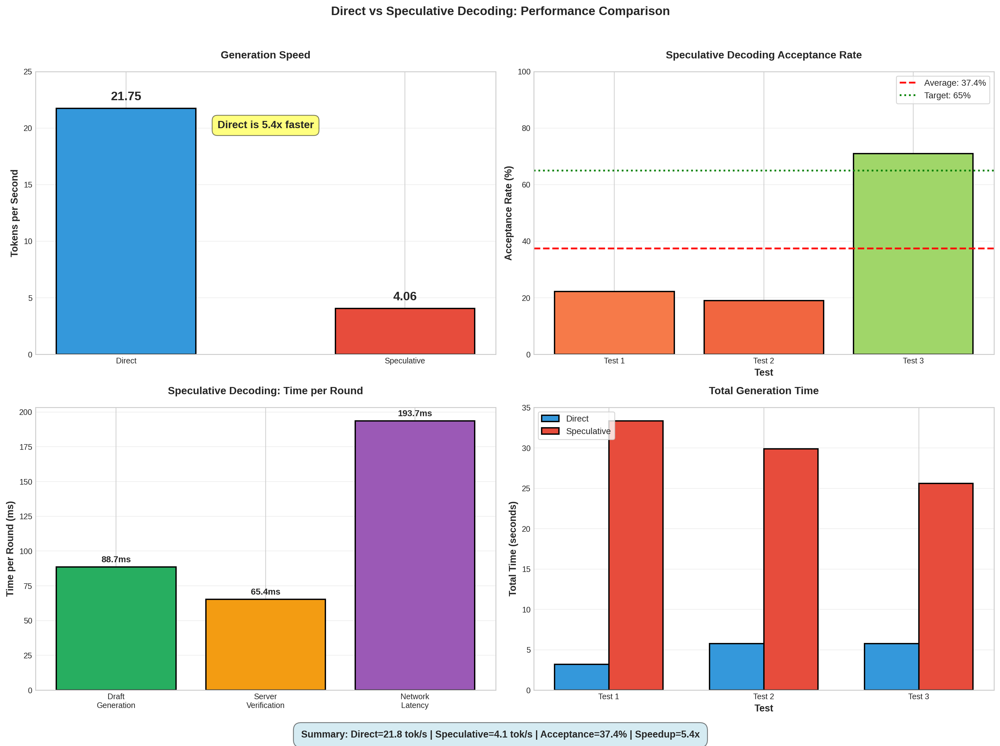
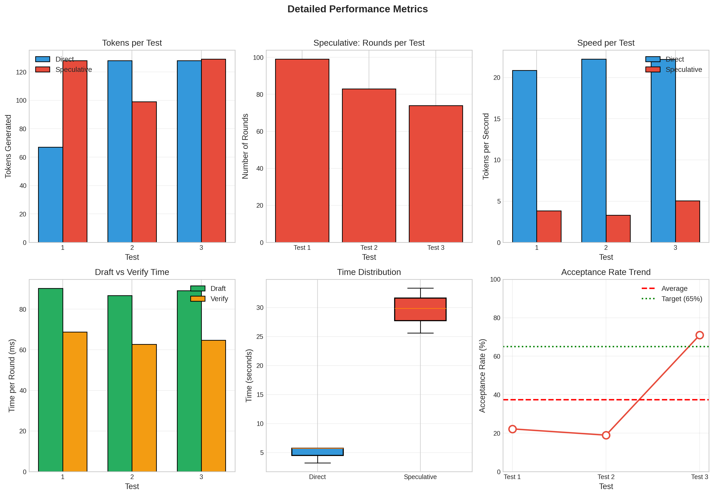

# Speculative Decoding 性能对比实验

**实验时间**: 2026-04-14 00:24  
**实验目的**: 对比Direct生成和Speculative Decoding的真实性能差异

## 📊 实验结果

### 核心发现

| 方法 | 平均速度 | 平均接受率 | 平均轮数 |
|------|---------|----------|---------|
| **Direct** | **21.75 tok/s** | - | - |
| **Speculative** | **4.06 tok/s** | 37.4% | 85.3 |

**结论**: Direct比Speculative **快5.36倍** ⚠️

### 可视化图表

**Main Comparison**: `charts_main.png`
- Generation Speed Comparison
- Acceptance Rate per Test
- Speculative Decoding Time Breakdown
- Total Generation Time



**Detailed Analysis**: `charts_detailed.png`
- Tokens Generated per Test
- Number of Rounds
- Speed per Test
- Draft vs Verify Time
- Time Distribution (Box Plot)
- Acceptance Rate Trend



### 详细数据

#### Direct生成
- Prompt 1: 67 tokens, 3.2s, **20.85 tok/s**
- Prompt 2: 128 tokens, 5.8s, **22.22 tok/s**
- Prompt 3: 128 tokens, 5.8s, **22.20 tok/s**

#### Speculative生成
- Prompt 1: 128 tokens, 33.4s, 3.84 tok/s (99轮, 接受率22.2%)
- Prompt 2: 99 tokens, 29.9s, 3.31 tok/s (83轮, 接受率19.0%)
- Prompt 3: 129 tokens, 25.6s, 5.03 tok/s (74轮, 接受率**70.9%**)

## 🔍 问题分析

### 1. 接受率差异巨大

- **最低**: 19.0% (Prompt 2)
- **最高**: 70.9% (Prompt 3)
- **平均**: 37.4%

**观察**: 不同prompt的接受率差异很大，说明draft模型对某些类型的文本预测更准确。

### 2. 时间分解 (每轮平均)

- **Draft生成**: ~88ms
- **Verify验证**: ~65ms
- **总计**: ~153ms/轮

对比Direct单token时间: 21.75 tok/s → **46ms/token**

**问题**: 即使接受率100%，每轮生成2个tokens需要153ms，相当于76.5ms/token，仍然比Direct慢67%！

### 3. 为什么Speculative这么慢？

#### 计算分析

假设接受率100%，K=2:
- Direct生成128 tokens: 128 × 46ms = **5.9秒**
- Speculative生成128 tokens: 64轮 × 153ms = **9.8秒**

**根本原因**:
1. **Draft开销太大** (88ms vs Direct 46ms)
   - 本地3B模型推理慢
   - 需要autoregressive生成K个tokens
   
2. **Verify时间** (65ms)
   - 包含网络RTT (SSH隧道)
   - 远程7B模型推理

3. **接受率不足**
   - 实际37.4%远低于100%
   - 导致大量轮次浪费

## 💡 优化方向

### 短期优化

1. **降低K值**
   - 当前K=2时，每轮overhead 153ms
   - 尝试K=1，减少draft时间

2. **优化Draft速度**
   - 使用量化模型 (4-bit)
   - GPU优化配置
   - 目标: 降到30ms以下

3. **减少网络延迟**
   - 本地部署verify模型
   - 或优化SSH隧道

### 长期优化

1. **提高接受率到70%+**
   - 使用更接近的draft模型
   - 训练专门的draft模型
   - 针对特定任务fine-tune

2. **自适应策略**
   - 根据接受率动态调整K
   - 低接受率时K=1，高接受率时K=3-4

3. **架构改进**
   - 考虑Medusa等多头方法
   - 并行speculative decoding

## 📈 性能目标

要让Speculative比Direct快，需要:

```
每轮时间 × 轮数 < Direct总时间
(Draft + Verify) × (Tokens / (K × 接受率)) < Tokens × 46ms

假设K=2:
(Draft + Verify) × (1 / 接受率) < 92ms

如果Draft=30ms, Verify=30ms:
60ms / 接受率 < 92ms
接受率 > 65%
```

**结论**: 需要同时满足:
- Draft时间 < 30ms
- Verify时间 < 30ms  
- 接受率 > 65%

## 📁 实验文件

| 文件 | 说明 |
|------|------|
| `compare_direct_vs_spec.py` | 实验主脚本 |
| `generate_charts_v2.py` | 图表生成脚本 |
| `results.json` | 详细结果数据 |
| `charts_main.png` | 主要对比图表 |
| `charts_detailed.png` | 详细分析图表 |
| `README.md` | 实验报告文档 |

## 🎯 下一步

1. ✅ 完成baseline对比
2. ⏭️ 测试K=1的性能
3. ⏭️ 优化draft模型速度
4. ⏭️ 尝试不同draft模型
5. ⏭️ 实现自适应K策略

---

**实验环境**:
- Draft模型: Qwen2.5-3B-Instruct (本地CUDA)
- Verify模型: Qwen2.5-7B-Instruct-AWQ (远程RTX 5090)
- 连接: SSH隧道
- Temperature: 0.8
