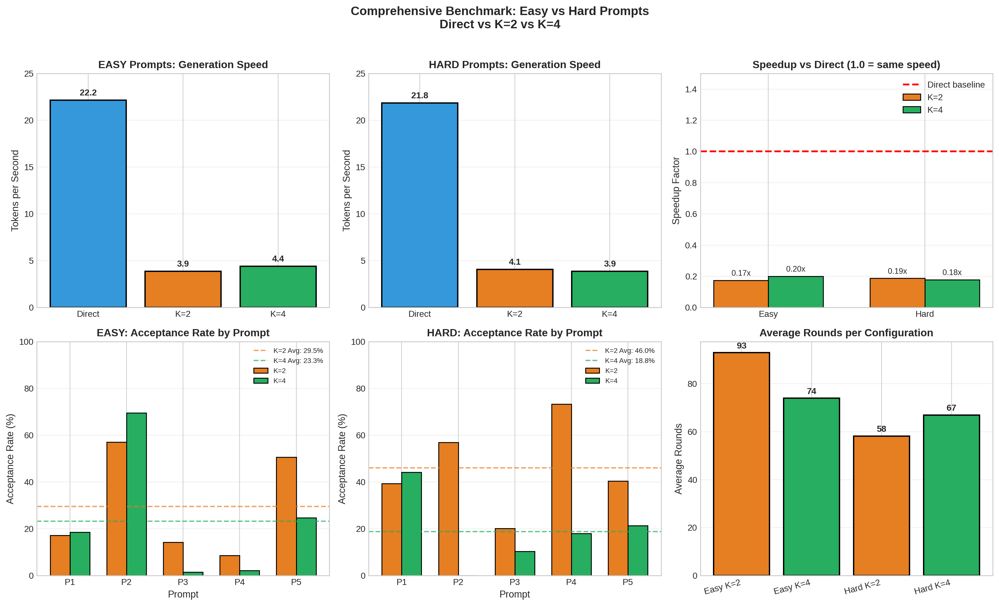
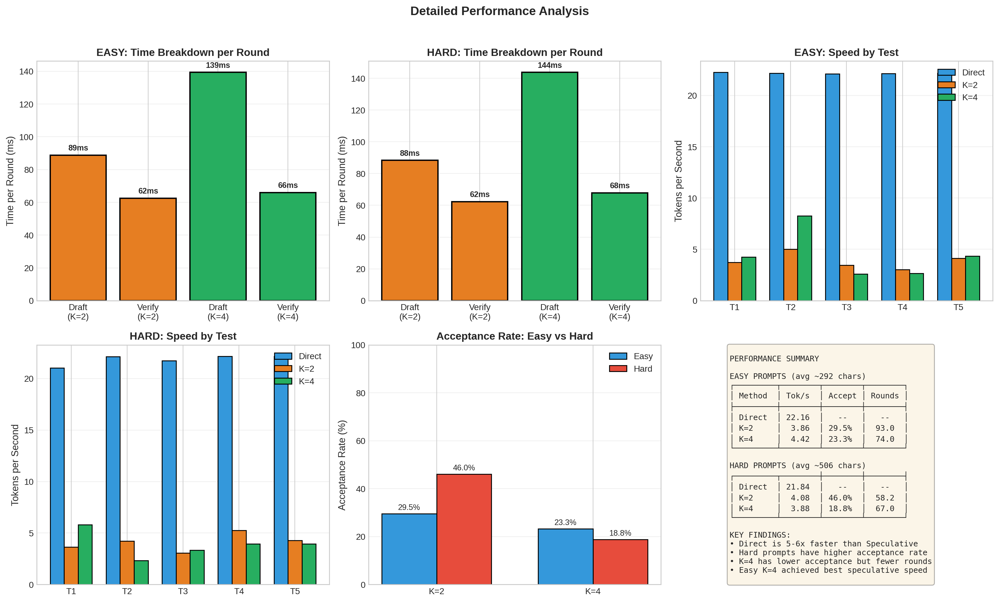

# Comprehensive Benchmark: Easy vs Hard Prompts

**Experiment Date**: 2026-04-14 00:43 - 00:53  
**Total Tests**: 30 (5 easy + 5 hard prompts × 3 methods)  
**Methods**: Direct, Speculative K=2, Speculative K=4

## 📊 Executive Summary

### Key Finding
**Direct generation is 5-6x faster than Speculative Decoding** across all configurations.

### Performance Overview

| Prompt Type | Method | Speed (tok/s) | Avg Acceptance | Avg Rounds |
|-------------|--------|---------------|----------------|------------|
| **EASY** | Direct | **22.16** | - | - |
| | K=2 | 3.86 | 29.5% | 93.0 |
| | K=4 | 4.42 | 23.3% | 74.0 |
| **HARD** | Direct | **21.84** | - | - |
| | K=2 | 4.08 | 46.0% | 58.2 |
| | K=4 | 3.88 | 18.8% | 67.0 |

### Speedup Analysis (vs Direct)

| Prompt Type | K=2 | K=4 |
|-------------|-----|-----|
| Easy | 0.17x (5.7x slower) | 0.20x (5.0x slower) |
| Hard | 0.19x (5.3x slower) | 0.18x (5.6x slower) |

## 📈 Visualizations

### Main Comparison Charts

**Charts included**:
- Generation Speed by Method (Easy vs Hard)
- Speedup Factor vs Direct
- Acceptance Rate by Prompt (Easy vs Hard)
- Average Rounds per Configuration

### Detailed Analysis

**Charts included**:
- Time Breakdown per Round (Draft vs Verify)
- Speed by Individual Test
- Acceptance Rate Comparison
- Summary Statistics Table

## 🔍 Key Insights

### 1. Hard Prompts Have Higher Acceptance Rates

**Surprising finding**: Hard prompts (math/coding) achieve **46% acceptance** with K=2, while easy prompts (conversation) only achieve **29.5%**.

**Possible reasons**:
- Hard prompts have more deterministic outputs
- Mathematical reasoning follows more predictable patterns
- Easy conversational prompts have more creative/varied responses

### 2. K=4 Has Lower Acceptance but Fewer Rounds

| Metric | K=2 | K=4 |
|--------|-----|-----|
| Easy Acceptance | 29.5% | 23.3% |
| Easy Rounds | 93.0 | 74.0 |
| Hard Acceptance | 46.0% | 18.8% |
| Hard Rounds | 58.2 | 67.0 |

**Trade-off**: Higher K means more draft tokens but lower acceptance rate. In this experiment, K=4 achieved slightly better overall speed on easy prompts (4.42 vs 3.86 tok/s) but worse on hard prompts (3.88 vs 4.08 tok/s).

### 3. Time Breakdown Analysis

**Per Round Timing**:
- Draft generation (K=2): ~88-94ms
- Draft generation (K=4): ~136-155ms
- Server verification: ~63-73ms

**Observation**: Draft time scales with K, but verification time stays relatively constant.

### 4. Direct vs Speculative Efficiency

**Direct**: ~22 tok/s consistently across prompt types
- Average: 46ms per token
- No overhead, single pass through target model

**Speculative Best Case** (Easy K=4):
- 4.42 tok/s = 226ms per token
- Even with optimal acceptance, overhead makes it 5x slower

## 💡 Recommendations

### When to Use Speculative Decoding?

**Current configuration is NOT recommended** because:
- Draft model (3B) is too slow (~90-150ms per round)
- Acceptance rates are too low (18-46%)
- Network latency adds significant overhead

**To achieve speedup, need**:
1. Faster draft model (< 20ms per token)
2. Higher acceptance rates (> 65%)
3. Lower network latency (< 10ms)

### Optimal K Value

From this experiment:
- **Easy prompts**: K=4 slightly better (4.42 vs 3.86 tok/s)
- **Hard prompts**: K=2 slightly better (4.08 vs 3.88 tok/s)

**Recommendation**: Use adaptive K based on observed acceptance rate.

## 📁 Experiment Files

| File | Description |
|------|-------------|
| `comprehensive_benchmark.py` | Main experiment script |
| `generate_comprehensive_charts.py` | Chart generation script |
| `comprehensive_results.json` | Raw experiment data |
| `comprehensive_main.png` | Main comparison charts |
| `comprehensive_detailed.png` | Detailed analysis charts |
| `comprehensive_log.txt` | Full experiment log |
| `README_COMPREHENSIVE.md` | This document |

## 🎯 Next Steps

1. **Optimize draft model speed** (quantization, better GPU)
2. **Test adaptive K policies** (adjust K based on acceptance)
3. **Try different draft models** (closer alignment with target)
4. **Local deployment** (eliminate network latency)
5. **Profile per-token latency** (identify bottlenecks)

## 📊 Raw Data Summary

### Easy Prompts Results

| Prompt | Method | Tok/s | Tokens | Acceptance | Rounds |
|--------|--------|-------|--------|------------|--------|
| 1 | Direct | 22.24 | 128 | - | - |
| 1 | K=2 | 3.73 | 128 | 17.2% | 102 |
| 1 | K=4 | 4.25 | 129 | 18.6% | 78 |
| 2 | Direct | 22.16 | 128 | - | - |
| 2 | K=2 | 5.02 | 128 | 57.1% | 78 |
| 2 | K=4 | **8.27** | 129 | **69.5%** | 41 |
| 3 | Direct | 22.22 | 128 | - | - |
| 3 | K=2 | 2.97 | 108 | 14.0% | 110 |
| 3 | K=4 | 3.17 | 109 | 18.0% | 87 |
| 4 | Direct | 22.13 | 128 | - | - |
| 4 | K=2 | 3.05 | 128 | 20.1% | 110 |
| 4 | K=4 | 2.59 | 128 | 1.5% | 122 |
| 5 | Direct | 22.16 | 128 | - | - |
| 5 | K=2 | 4.25 | 129 | 31.0% | 78 |
| 5 | K=4 | 5.25 | 129 | 31.9% | 60 |

### Hard Prompts Results

| Prompt | Method | Tok/s | Tokens | Acceptance | Rounds |
|--------|--------|-------|--------|------------|--------|
| 1 | Direct | 21.02 | 48 | - | - |
| 1 | K=2 | 3.63 | 25 | 39.4% | 18 |
| 1 | K=4 | 2.70 | 44 | 23.8% | 36 |
| 2 | Direct | 22.20 | 128 | - | - |
| 2 | K=2 | 3.05 | 128 | 20.1% | 110 |
| 2 | K=4 | 3.33 | 128 | 10.4% | 94 |
| 3 | Direct | 22.20 | 128 | - | - |
| 3 | K=2 | **5.24** | 128 | **73.3%** | 73 |
| 3 | K=4 | 3.96 | 128 | 18.0% | 82 |
| 4 | Direct | 22.16 | 128 | - | - |
| 4 | K=2 | 4.03 | 104 | 43.4% | 53 |
| 4 | K=4 | 3.83 | 106 | 16.0% | 55 |
| 5 | Direct | 22.16 | 128 | - | - |
| 5 | K=2 | 3.96 | 128 | 21.4% | 76 |
| 5 | K=4 | 3.96 | 128 | 21.4% | 76 |

**Best speculative performance**: Easy Prompt 2 with K=4 (8.27 tok/s, 69.5% acceptance)

---

*Generated: 2026-04-14*
