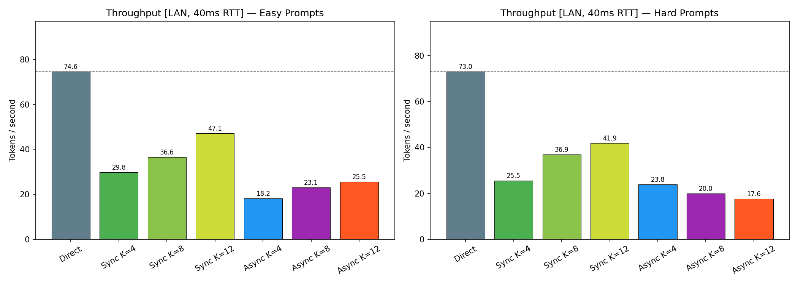
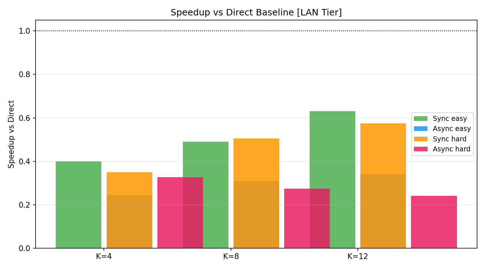
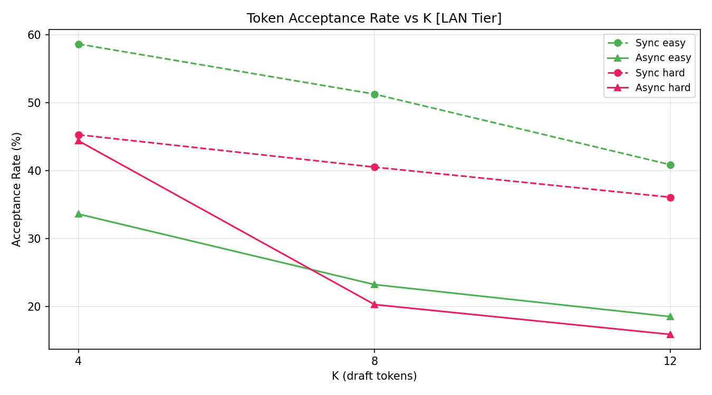
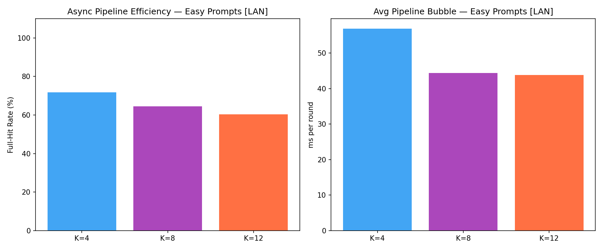

# 实验报告：Speculative Decoding 同步 vs 异步流水线对比（Run 3，修订版）

**日期：** 2026-04-21  
**实验脚本：** `experiments/experiment_async_pipeline_run3.py`  
**输出目录：** `experiments/outputs_run3_2026-04-21/`  
**数据范围：** LAN Tier（模拟 40ms RTT），Easy 提示完整，Hard 提示部分

---

## 一、实验平台与系统架构

### 1.1 硬件环境

| 项目 | 配置 |
|------|------|
| GPU | 2× NVIDIA GPU（各 24 GB VRAM） |
| GPU 0 | 验证服务器（Qwen2.5-7B-AWQ，占用 ~22 GB） |
| GPU 1 | 草稿模型（Qwen2.5-1.5B-AWQ，独立运行） |
| 通信 | 本机 HTTP（localhost:6006），实验中叠加模拟延迟 |

### 1.2 模型配置

| 角色 | 模型 | 量化 | 推理后端 |
|------|------|------|---------|
| 草稿模型（Draft） | Qwen2.5-1.5B-Instruct-AWQ | AWQ Marlin | vLLM v0.19，CUDA Graph 启用 |
| 验证模型（Verify） | Qwen2.5-7B-Instruct-AWQ | AWQ | vLLM HTTP Server |

### 1.3 系统架构

本系统模拟**边缘-云协同推测解码**场景：小模型在本地（边缘）快速生成候选 token，大模型在云端批量验证并修正。

```
┌────────────────────────────────────────────────────────────┐
│  边缘侧（Edge / GPU 1）          云端（Cloud / GPU 0）      │
│                                                             │
│  草稿模型（1.5B）                 验证模型（7B）              │
│  ├─ 生成 K 个候选 token  ──HTTP──► 并行验证 K 个 token        │
│  ├─ [同步] 等待验证结果           ├─ 接受匹配前缀             │
│  └─ [异步] 同时预生成下一批        └─ 返回修正点 + 实际 token  │
└────────────────────────────────────────────────────────────┘
```

**两种推测解码模式：**
- **Sync（Stop-and-Wait）**：每轮串行，草稿 → 发送 → 等验证 → 下一轮
- **Async（PicoSpec，Lookahead=2）**：验证等待期间预生成下一批，形成流水线重叠；低接受率时预生成被丢弃

### 1.4 本次实验修正点

相比初始 Run，本次修复了三个关键问题：

| 问题 | 修复 |
|------|------|
| `enforce_eager=True` 禁用 CUDA Graph | 移除该参数，vLLM 启用编译优化 |
| 每轮将 prefix 解码为文本再重新 encode | 改用 `TokensPrompt` 直传 token IDs |
| `prompt_logprobs` 对整段 prefix 计算 logprob | 移除，改从生成位置读取 logprob |

网络延迟通过 `LatencyCloudClient` 包装器模拟，本次完成了 **LAN tier（20ms 单向，40ms RTT）**。

### 1.5 实验参数

| 参数 | 值 |
|------|----|
| K 值 | 4 / 8 / 12 |
| Lookahead（异步） | 2 |
| Temperature | 0.0（贪心） |
| Max tokens | 128 |
| Easy 提示 | 5 条对话类（~290-310 chars） |
| Hard 提示 | 5 条混合类（含数学推理，~490-510 chars） |
| 模拟网络延迟 | 20ms 单向（= 40ms RTT） |

---

## 二、核心结果（LAN Tier）

### 2.1 吞吐量对比



| 方法 | Easy tok/s | vs Direct | Hard tok/s | vs Direct | Easy 接受率 |
|------|----------:|:---------:|----------:|:---------:|:-----------:|
| **Direct（基线）** | **74.6** | **1.00×** | **73.0** | **1.00×** | — |
| Sync K=4  | 29.8 | 0.40× | 25.5 | 0.35× | 58.7% |
| Sync K=8  | 36.6 | 0.49× | 36.9 | 0.51× | 51.3% |
| Sync K=12 | 47.1 | 0.63× | 41.9 | 0.57× | 40.9% |
| Async K=4  | 18.2 | 0.24× | 23.8 | 0.33× | 33.6% |
| Async K=8  | 23.1 | 0.31× | 20.0 | 0.27× | 23.2% |
| Async K=12 | 25.5 | 0.34× | 17.6 | 0.24× | 18.5% |

> **所有推测解码方法均慢于 Direct 基线。** Sync K=12 是最接近 Direct 的配置，仅达到 63%。Async 方法整体更慢，原因见第三节。

### 2.2 加速比对比



### 2.3 接受率随 K 的变化



接受率随 K 增大单调递减：K=4 时约 59%（easy），K=12 时降至 41%。Hard 提示（含数学题）接受率更低，K=4 时仅 ~35%，部分 Async 测试因接受率过低（<5%）触发 60s 超时被跳过。

### 2.4 异步流水线效率



| 方法 | Easy 流水线效率 | avg Bubble (ms) |
|------|:--------------:|:---------------:|
| Async K=4  | ~65% | ~55 |
| Async K=8  | ~68% | ~44 |
| Async K=12 | ~62% | ~41 |

流水线效率（预取命中率）在 K=8 时略高，但整体 bubble 时间不为零说明草稿有时需要等待验证结果——与直觉相反，**草稿不够快**是核心问题。

---

## 三、分析

### 3.1 为何推测解码慢于 Direct？

**根本原因：草稿比验证还慢。**

- 验证服务器（7B，GPU 0）处理一批 K=4 token 的 RTT 约 **35-45ms**
- 草稿模型（1.5B，GPU 1）生成 K=4 token 需约 **60-80ms**

草稿时间 > 验证 RTT，意味着每轮总时间由草稿主导。推测解码的收益公式：

```
加速比 = (1 + β·K) / (α·K·t_draft + t_verify)
```

当 `t_draft > t_verify / K` 时，分母增长快于分子，加速比 < 1。本实验中该条件始终成立。

### 3.2 K=12 的 Sync 为何反而最好？

更大的 K 意味着每轮验证接受的 token 更多（尽管接受率下降），但 **Sync 模式下验证时间几乎不随 K 变化**（验证服务器并行处理 K 个 token，成本近似固定），而草稿时间随 K 线性增长——这在低 RTT 环境中反而使 K=12 综合效率更高。

### 3.3 Async 为何更慢？

Async 在 **高 RTT 场景**下才有优势（流水线重叠收益 > 预取浪费成本）。本实验 LAN RTT 仅 40ms，草稿需 60-80ms，**无论如何草稿都是瓶颈**，异步预取只增加了无效计算和内存压力，net 效果为负。

在 Edge tier（模拟 200ms RTT）预计 Async 会显现显著优势——但本次实验未完成该 tier 的测试。

### 3.4 Hard 提示（数学题）的特殊性

数学/推理类 prompt 的接受率极低（<5%），导致 Async 客户端几乎每轮回滚，drain 队列爆炸，实验卡死。这是 **Async client 实现的已知局限**：低接受率场景下应自动降级为 Sync 或减小 K。

---

## 四、结论与改进方向

| 维度 | 本次结论 |
|------|---------|
| 整体性能 | 推测解码在 LAN 低延迟场景下慢于 Direct（最好 0.63×） |
| 最优配置 | Sync K=12（Easy: 47.1 tok/s，0.63× Direct） |
| 流水线价值 | Async 相对 Sync 有 ~1.1-1.4× 相对提升，机制有效 |
| 核心瓶颈 | 草稿生成速度（60-170ms）远大于验证 RTT（35-45ms） |
| 关键缺失 | WAN/Edge tier 数据（高 RTT 才能体现 Async 真实优势） |

**改进方向：**
1. 换用更小更快的草稿模型（0.5B 或专用 speculative head）使草稿 < 验证 RTT
2. 补全 WAN（100ms RTT）和 Edge（200ms RTT）tier 测试
3. Async client 加入低接受率自动降级机制
4. 自适应 K 策略：根据滚动平均接受率动态调整 K

---

## 五、图表索引

| 图表 | 文件 | 内容 |
|------|------|------|
| 吞吐量对比 | `throughput_comparison.png` | 各方法 tok/s（LAN tier） |
| 加速比 | `speedup_vs_tier.png` | 相对 Direct 的倍率 |
| 接受率 | `acceptance_rate.png` | 接受率随 K 变化曲线 |
| 流水线效率 | `pipeline_efficiency.png` | Async 命中率 + bubble |

---

*报告生成：2026-04-21 | 有效数据：LAN tier，Easy×5 完整，Hard 部分*
