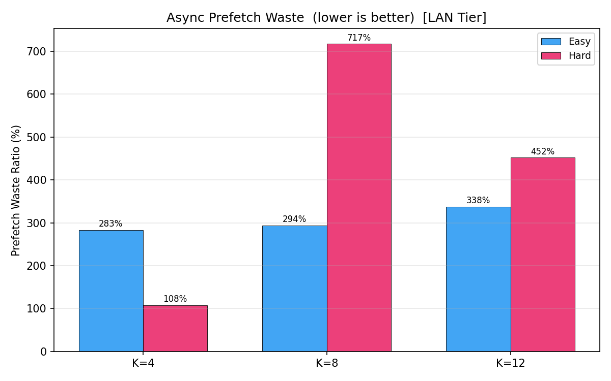

# 实验报告：同步 vs 异步推测解码流水线对比（Run 3）

**日期：** 2026-04-21  
**实验脚本：** `experiments/experiment_async_pipeline_run3.py`  
**输出目录：** `experiments/outputs_run3_2026-04-21/`  
**数据范围：** LAN Tier（模拟单向 20ms，RTT 40ms），Easy 提示 5 条完整，Hard 提示部分

---

## 一、实验平台与系统架构

### 1.1 硬件环境

| 项目 | 配置 |
|------|------|
| GPU | 2× NVIDIA GPU（各 24 GB VRAM） |
| GPU 0 | 验证服务器（Qwen2.5-7B-AWQ，占用 ~22 GB） |
| GPU 1 | 草稿模型（Qwen2.5-1.5B-AWQ，独立运行） |
| 通信 | 本机 HTTP（localhost:6006），实验中叠加模拟延迟 |

### 1.2 模型配置

| 角色 | 模型 | 量化 | 推理后端 |
|------|------|------|---------|
| 草稿模型（Draft） | Qwen2.5-1.5B-Instruct-AWQ | AWQ Marlin | vLLM v0.19，CUDA Graph 启用 |
| 验证模型（Verify） | Qwen2.5-7B-Instruct-AWQ | AWQ | vLLM HTTP Server |

### 1.3 系统架构

本系统模拟**边缘-云协同推测解码**场景：小模型在本地（边缘）快速生成候选 token，大模型在云端批量验证并修正。

```
┌────────────────────────────────────────────────────────────┐
│  边缘侧（Edge / GPU 1）          云端（Cloud / GPU 0）      │
│                                                             │
│  草稿模型（1.5B）                 验证模型（7B）              │
│  ├─ 生成 K 个候选 token  ──HTTP──► 并行验证 K 个 token        │
│  ├─ [同步] 等待验证结果           ├─ 接受匹配前缀             │
│  └─ [异步] 同时预生成下一批        └─ 返回修正点 + 实际 token  │
└────────────────────────────────────────────────────────────┘
```

**两种推测解码模式：**
- **Sync（Stop-and-Wait）**：每轮串行，草稿 → 发送 → 等验证 → 下一轮
- **Async（PicoSpec，Lookahead=2）**：验证等待期间预生成下一批，形成流水线重叠；低接受率时预生成被丢弃

### 1.4 本次实验修正点

相比初始 Run，本次修复了三个关键问题：

| 问题 | 修复 |
|------|------|
| `enforce_eager=True` 禁用 CUDA Graph | 移除该参数，vLLM 启用编译优化 |
| 每轮将 prefix 解码为文本再重新 encode | 改用 `TokensPrompt` 直传 token IDs |
| `prompt_logprobs` 对整段 prefix 计算 logprob | 移除，改从生成位置读取 logprob |

网络延迟通过 `LatencyCloudClient` 包装器模拟，本次完成了 **LAN tier（20ms 单向，40ms RTT）**。

### 1.5 实验参数

| 参数 | 值 |
|------|----|
| K 值 | 4 / 8 / 12 |
| Lookahead（异步） | 2 |
| Temperature | 0.0（贪心） |
| Max tokens | 128 |
| Easy 提示 | 5 条对话类（~290-310 chars） |
| Hard 提示 | 5 条混合类（含数学推理，~490-510 chars） |
| 模拟网络延迟 | 20ms 单向（= 40ms RTT） |

---

## 二、核心结果（LAN Tier，RTT 40ms）

### 2.1 吞吐量：Sync vs Async


**Easy 提示（对话类）：**

| 方法 | tok/s | 接受率 | Async/Sync |
|------|------:|:------:|:----------:|
| Sync  K=4  | 29.8 | 58.7% | — |
| Async K=4  | 18.2 | 33.6% | 0.61× |
| Sync  K=8  | 36.6 | 51.3% | — |
| Async K=8  | 23.1 | 23.2% | 0.63× |
| Sync  K=12 | 47.1 | 40.9% | — |
| Async K=12 | 25.5 | 18.5% | 0.54× |

**Hard 提示（数学/推理类，部分数据）：**

| 方法 | tok/s | 接受率 | Async/Sync |
|------|------:|:------:|:----------:|
| Sync  K=4  | 25.5 | 45.3% | — |
| Async K=4  | 23.8 | 44.4% | 0.93× |
| Sync  K=8  | 36.9 | 40.5% | — |
| Async K=8  | 20.0 | 20.3% | 0.54× |
| Sync  K=12 | 41.9 | 36.1% | — |
| Async K=12 | 17.6 | 15.9% | 0.42× |

> 在 LAN 低延迟场景下，**Sync 全面优于 Async**。Async 吞吐量为 Sync 的 42%–93%。

### 2.2 Async/Sync 比值


- Easy prompts：Async/Sync 比值在 0.54–0.63× 之间，随 K 变化不单调
- Hard prompts：K=4 时最接近（0.93×），K 增大后急剧下降至 0.42×
- 比值始终 < 1.0，说明在当前 RTT 条件下异步流水线无法弥补预取浪费

### 2.3 接受率随 K 的变化


- **Sync 接受率高于 Async**：Sync 从 prefix 精确续写，Async 因预取时 prefix 状态提前推进，匹配率更低
- 两种模式接受率均随 K 增大单调下降
- Hard prompts（数学题）的 Async 接受率在 K=8/12 时接近 0，触发 60s 超时被跳过

### 2.4 异步流水线内部指标


| 方法 | Easy 命中率 | Easy Bubble | Hard 命中率 | Hard Bubble |
|------|:----------:|:-----------:|:----------:|:-----------:|
| Async K=4  | 72% | 57ms | 81% | 51ms |
| Async K=8  | 65% | 44ms | 39% | 54ms |
| Async K=12 | 60% | 44ms | 59% | 58ms |

命中率（预取批次无需回滚的轮次比例）在 K=4 时最高。Bubble 时间（草稿等待验证结果的空闲时间）不为零，说明草稿在当前 RTT 下并非总能及时填满流水线。

### 2.5 预取浪费率



Easy prompts 浪费率为 283–338%，Hard prompts 更高达 108–717%。浪费率 = 被回滚丢弃的草稿 token 数 / 实际接受的 token 数。浪费率高是 Async 在低 RTT 场景吞吐量低于 Sync 的直接原因。

---

## 三、分析

### 3.1 为何 Async 在 LAN 下慢于 Sync？

**核心矛盾：草稿比验证慢。**

本实验中：
- 验证 RTT ≈ **35–45ms**（7B 模型，GPU 0）
- 草稿生成 K=4 token ≈ **60–80ms**（1.5B 模型，GPU 1）

草稿时间 > 验证 RTT，流水线瓶颈在草稿侧。Async 的流水线重叠收益（省去等待验证的时间）无法抵消预取浪费的额外计算，净效果为负。

**Async 需要 RTT > 草稿时间才能盈利。** 以 K=4 为例：草稿约 70ms，因此需要 RTT > 70ms（即 WAN/Edge 场景）时，Async 才有正收益。

### 3.2 为何 Sync K=12 吞吐量最高？

验证服务器并行验证 K 个 token，成本近似固定（不随 K 线性增长）。因此：

- 每轮期望接受 token 数 = K × 接受率
- K=12，接受率 41% → 每轮期望接受 ≈ 4.9 tokens
- K=4，接受率 59%  → 每轮期望接受 ≈ 2.4 tokens

更大的 K 使每轮验证的"产出"更高，尽管草稿时间增加，但综合仍更优。

### 3.3 Hard Prompts 的特殊问题

数学/推理 prompt 的接受率极低（K=8 时 Async 仅 ~20%），回滚几乎每轮发生，预取完全无效，Async 客户端的内部队列积压导致实验超时。这揭示了一个实现层面的缺陷：**低接受率时应自动降级为 Sync 或缩小 K**。

---

## 四、结论

| 维度 | 结论 |
|------|------|
| **Sync vs Async（LAN）** | Sync 全面优于 Async，比值 0.42–0.93× |
| **最优配置** | Sync K=12（Easy: 47.1 tok/s；Hard: 41.9 tok/s） |
| **流水线机制本身** | 有效——命中率 60–81%，但 RTT 太低无法弥补浪费 |
| **Async 适用条件** | RTT > 草稿生成时间（本实验需 RTT > 70ms，即 WAN/Edge 场景） |
| **缺口** | WAN（100ms RTT）和 Edge（200ms RTT）数据未完成，是验证 Async 优势的关键 |

**改进方向：**
1. 补全 WAN/Edge tier 实验（Async 预期在此展现显著优势）
2. Async client 加入低接受率自动降级逻辑
3. 自适应 K：根据滚动接受率动态调整，避免高 K 在低接受率场景浪费
4. 更快草稿模型（0.5B 或专用 speculative head）以满足 RTT < 草稿时间的条件

---

## 五、图表索引

| 图表 | 文件 |
|------|------|
| Sync vs Async 吞吐量 | `throughput_comparison.png` |
| Async/Sync 比值曲线 | `speedup_vs_tier.png` |
| 接受率随 K 变化 | `acceptance_rate.png` |
| 流水线命中率 + Bubble | `pipeline_efficiency.png` |
| 预取浪费率 | `bubble_time.png` |

---

*报告生成：2026-04-21 | 数据：LAN tier，Easy×5 完整，Hard 部分（K=4 各 3 条，K=8/12 各 2 条）*
