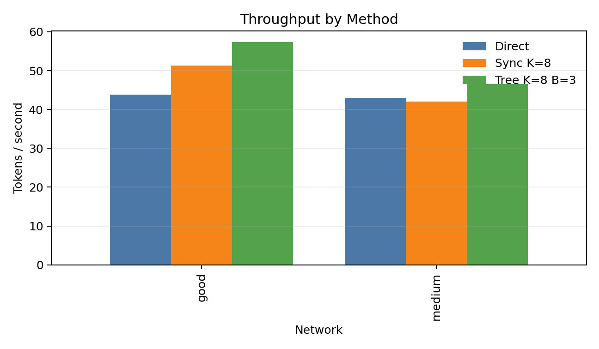
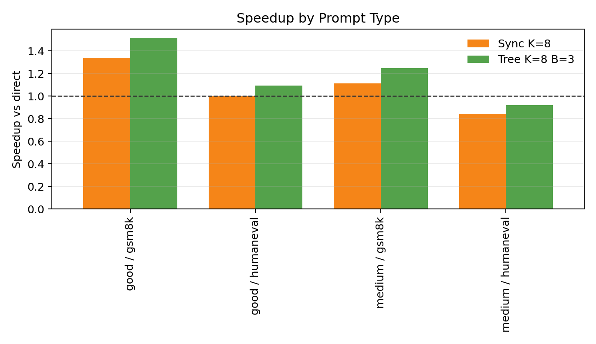
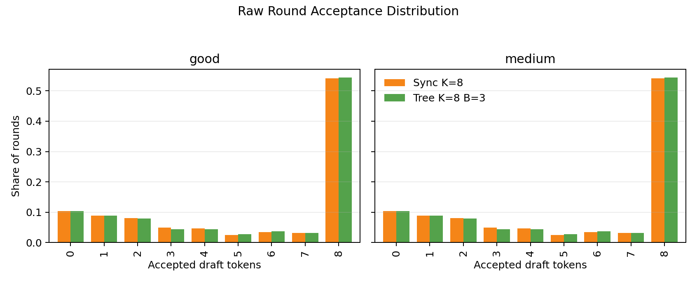
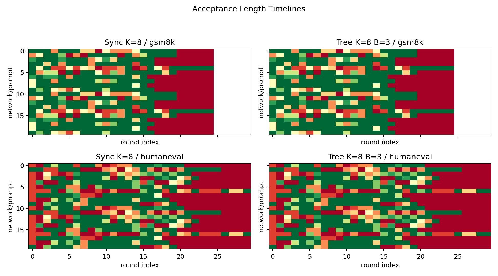
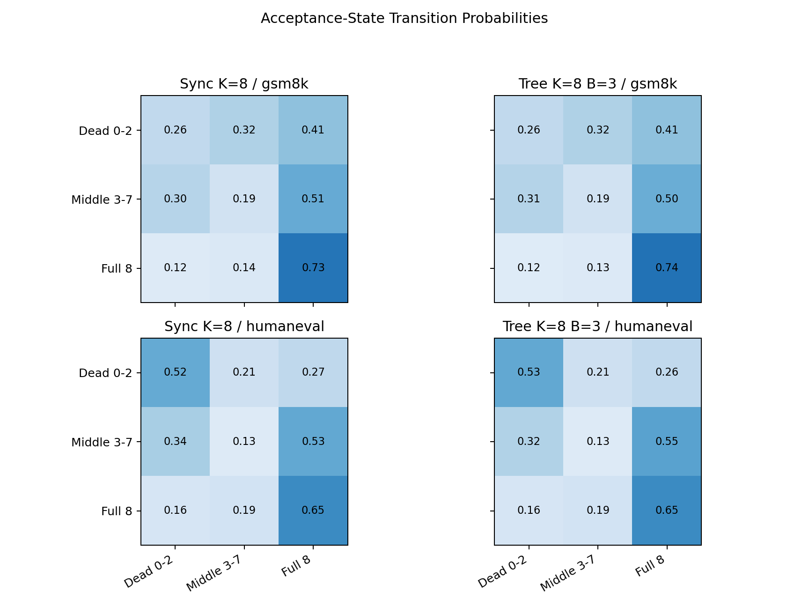
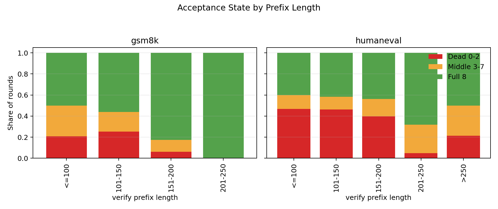
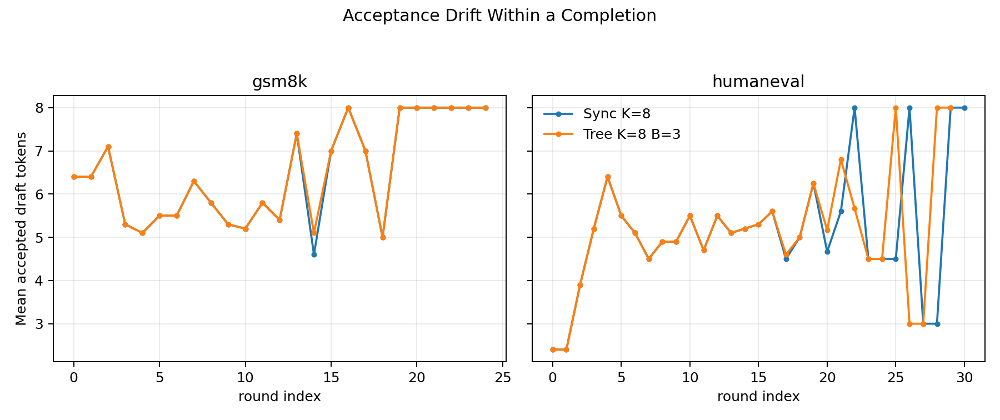
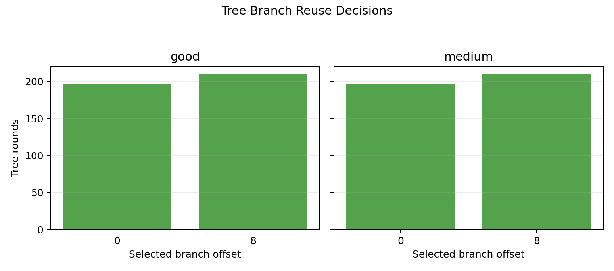
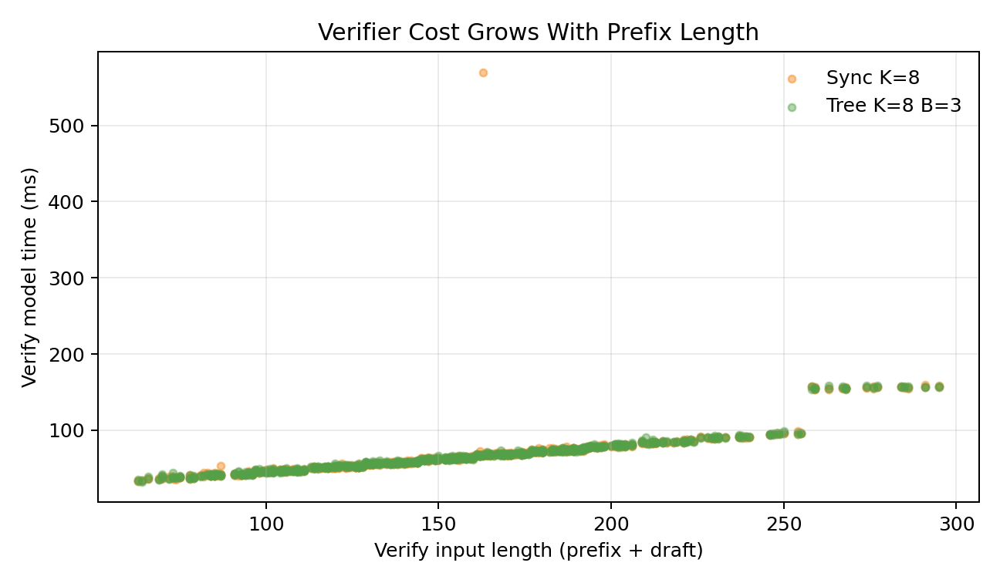

# Quick Experiment Raw-Data Report

Data source: raw `quick_test_results.json` and `quick_test_rounds.jsonl` records from `scripts/experiments/outputs_quick/`.

The run contains 120 completed top-level runs: `good` and `medium` networks, three methods, two prompt sets, and ten prompts per prompt set. The raw data does not contain completed `bursty` runs, so this report ignores the zero-filled bursty entries in `quick_test_summary.json`.

## Main Result

| Network | Direct tok/s | Sync K=8 tok/s | Tree K=8 B=3 tok/s | Tree vs direct | Tree vs sync | Tree avg wall-time delta vs direct |
|---|---:|---:|---:|---:|---:|---:|
| good | 43.89 | 51.34 | 57.34 | 1.31x | 1.12x | -429 ms |
| medium | 43.03 | 42.04 | 46.53 | 1.08x | 1.11x | +65 ms |

Tree async is the strongest method in both networks on tokens/sec. It improves over synchronous speculative decoding by about 11-12%, which is the clearest evidence that branch pre-drafting is absorbing part of the verification/RTT wait.

For latency, the result is more nuanced. On `good`, Tree is both higher throughput and lower wall time than direct. On `medium`, Tree has higher tokens/sec but is still slightly slower in average wall time than direct, because speculative runs generated about 132 tokens on average while direct generated about 125. This makes throughput and end-to-end latency answer different questions.

## Prompt-Type Split

| Network / prompt | Sync K=8 vs direct | Tree K=8 B=3 vs direct | Observation |
|---|---:|---:|---|
| good / gsm8k | 1.34x | 1.52x | Strong win; high acceptance keeps rounds low. |
| good / humaneval | 1.00x | 1.09x | Tree helps, but the base task is close to break-even. |
| medium / gsm8k | 1.11x | 1.25x | Still a meaningful win despite larger RTT. |
| medium / humaneval | 0.84x | 0.92x | Network overhead plus lower acceptance makes speculation lose to direct. |

The result is dominated by prompt family. GSM8K is consistently favorable; HumanEval is the weak case. This suggests the next experiment should report results by prompt family, not only as a single average, because the average hides one winning workload and one borderline or losing workload.

## Acceptance Behavior

The raw round-level distribution is highly bimodal. About 54% of rounds accept all 8 draft tokens, while about 27% accept only 0-2 tokens. The average acceptance rate is about 0.71 overall, but that average is less informative than the bimodality: the system alternates between very efficient rounds and rounds that mostly pay the draft cost without much token progress.

The acceptance distribution is effectively identical across `good` and `medium`, as expected, because the network condition changes timing rather than token decisions.

## Acceptance Dynamics

Additional raw-round analysis was written to `acceptance_dynamics/` using `analyze_acceptance_dynamics.py`. I classify acceptance length into three states: dead zone `0-2`, middle `3-7`, and full accept `8`.

The dead zone is not totally random. It clusters by prompt and local generation phase, especially in HumanEval. Across both methods, HumanEval has about a 34-35% dead-zone base rate, but after a dead round the next round is dead about 52-53% of the time. GSM8K also clusters, but more weakly: its dead-zone base rate is about 18%, and dead-after-dead is about 26%.

| Method / prompt | Base dead-zone rate | Dead after dead | Clustering lift |
|---|---:|---:|---:|
| Sync / GSM8K | 18.4% | 26.5% | 1.44x |
| Sync / HumanEval | 34.7% | 51.9% | 1.50x |
| Tree / GSM8K | 18.4% | 26.5% | 1.44x |
| Tree / HumanEval | 34.4% | 52.6% | 1.53x |

The previous state is predictive enough to matter. If the previous round was full accept, the next round stays full about 69-70% overall; for GSM8K it is about 73-74%. If the previous round was dead, the next round is much less likely to recover immediately, especially on HumanEval. This suggests the current policy should not treat every round as independently drawn from the global acceptance average.

Prefix length alone is not the right predictor. Verifier cost rises with prefix length, but acceptance often improves later in the completion, especially in GSM8K and mid-to-late HumanEval ranges. That means a prefix-length-only rule would be misleading: the expensive later rounds can still be high-accept and worth speculating.

Middle acceptance is real but secondary. It accounts for only about 18-20% of rounds, with an average middle acceptance of about 4.6-5.0 tokens. These rounds are not the main reason Tree wins today, because the current branch strategy mostly monetizes full-accept offset 8. But they are the next research opportunity: if middle rounds can be predicted or cheaply supported, a second branch around offset 4-6 could recover useful work that is currently thrown away.

Practical policy implications:

1. Add a recent-acceptance state to the K/branch policy. After one or two dead rounds, shrink K or temporarily skip expensive branch prefetching, especially for HumanEval-like prompts.
2. Keep the offset-8 branch for full-accept streaks. Full accept is sticky enough that this is still the highest-value branch.
3. Treat middle rounds as conditional value, not noise. They are too infrequent to dominate the policy, but an adaptive branch at offset 4 or 6 could be tested when recent history is middle/full rather than dead.
4. Do not use network condition to predict acceptance. Good and medium have essentially the same acceptance traces; network changes the penalty of a bad speculative decision, not the token match itself.

## Tree Branch Reuse

| Network | Offset 0 slots | Offset 8 slots | Prefetched tokens when offset 8 selected | Exposed branch ms |
|---|---:|---:|---:|---:|
| good | 196 | 210 | 6.35 | 0.018 ms |
| medium | 196 | 210 | 6.94 | 0.009 ms |

Tree reuse is almost a binary decision: either the base draft was fully accepted and the offset-8 branch becomes useful, or the run falls back to offset 0. Offset 8 is selected slightly more than half the time, matching the full-acceptance mass in the distribution. When offset 8 is selected, the branch is already ready, so the exposed branch wait is basically zero.

This is the core reason Tree beats Sync: it does not improve acceptance much, but it turns many full-accept rounds into prefetched progress for the next slot.

## Verifier Cost

The verifier averages about 66-68 ms per speculative round, with p90 around 85-86 ms. Cost grows with `prefix + draft` length, and longer HumanEval continuations reach roughly 150-160 ms per verify. There is also one clear outlier in `good/sync_k8/gsm8k prompt_id=4`, where a verify call took about 570 ms.

Medium-network slowdown is mostly per-round network overhead, not verifier slowdown: average verifier time stays near 66 ms, while average RTT rises from about 94 ms to 124 ms. With about 20 rounds per completion, that extra RTT is large enough to erase the synchronous method's gains and make Tree only marginal on total wall time.

## Takeaways

1. Tree async is working: it consistently beats synchronous speculative decoding by about 11% tokens/sec and saves about 250-280 ms versus Sync at the same network level.
2. The method is most convincing on GSM8K, where Tree reaches 1.52x on `good` and 1.25x on `medium`.
3. HumanEval is the stress case. It has lower acceptance, more rounds, longer verifier prefixes, and loses on `medium`.
4. Reporting only average acceptance hides the real behavior. Full-accept rounds are the opportunity; low-accept rounds are the cost center.
5. Dead zones are partially predictable from recent acceptance history. The next optimization target should be a stateful K/branch policy that backs off after dead-zone clusters and tests a middle-offset branch only when recent history makes it plausible.
