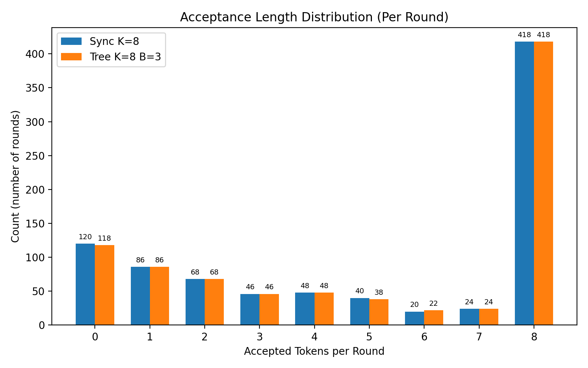
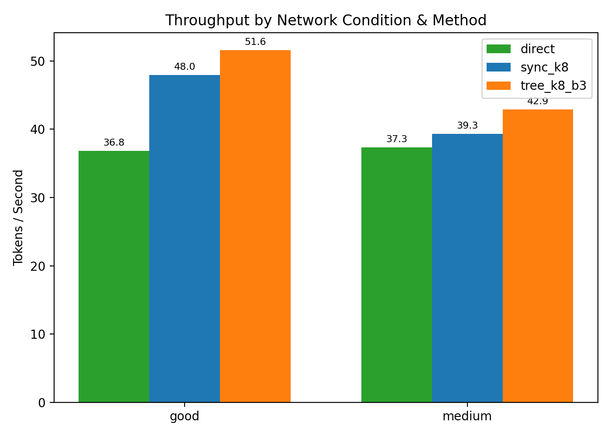
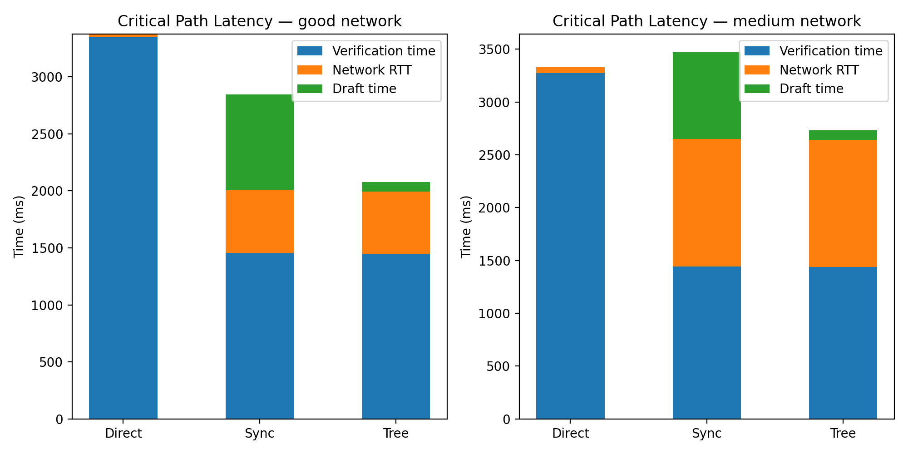
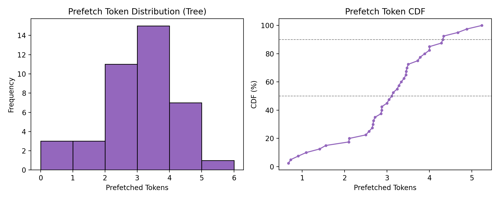
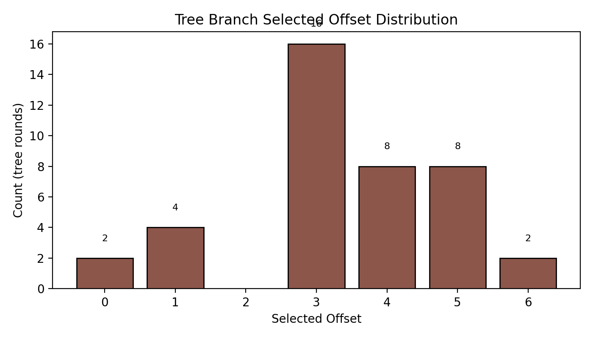

# 快速测试结果 — 统计分析报告

**生成时间:** Mon May 11 08:11:24 PDT 2026
**数据文件:** `quick_test_results.json`, `quick_test_rounds.jsonl`, `quick_test_summary.json`

## 执行摘要

- **提示词记录数:** 120
- **同步轮数:** 870 | **树形轮数:** 868
- **加速比 (Tree vs Sync):** 1.0769x ± 0.0332 (n=20)
- **95% 置信区间:** [1.0624, 1.0915]
- **接受率分布:** 完全接受 (8/8) ≈ 48.0%, 短接受 (0–2) ≈ 31.5%

## 核心结论: Tree Async 是否真正有效

这个项目的目标不是单纯比较模型速度，而是验证 **edge draft model + cloud verification model** 在真实网络 RTT 下，能否让本地预草稿窗口吸收远端 verification + RTT 的等待时间。

| 网络 | Tree/Sync 平均加速 | Tree 赢的样本 | 平均轮数差(Tree-Sync) | verification+RTT 被草稿窗口吸收程度 | 复用轮次比例 | P90 预取 tokens | 有用预取/流式分支 tokens |
|---|---:|---:|---:|---:|---:|---:|---:|
| good | 1.073x | 10/10 | -0.10 | 99.93% | 44.7% | 7.0 | 19.2% |
| medium | 1.081x | 10/10 | -0.10 | 99.99% | 44.7% | 7.0 | 19.5% |

解释: `exposed_branch_ms` 接近 0 不是草稿时间不存在；在这个场景下，更准确的说法是: edge 的预草稿窗口把 cloud verification + RTT 的等待吸收进了本地 draft pipeline。真正应该从 raw slot details 读 `branch_draft_ms`、`base_wait_ms/total_wait_ms`、`prefetched_tokens` 和 `selected_offset`。

## 表1: 各网络条件与方法下的吞吐量

| 网络 | 方法 | n | 平均 tok/s | 标准差 | 最小值 | P50 | P90 | 最大值 |
|---|---|---:|---:|---:|---:|---:|---:|---:|
| good | sync_k8 | 20 | 47.96 | 10.77 | 26.59 | 48.66 | 58.80 | 66.87 |
| good | tree_k8_b3 | 20 | 51.59 | 12.11 | 27.18 | 52.65 | 65.79 | 71.34 |
| medium | sync_k8 | 20 | 39.33 | 8.50 | 22.56 | 39.65 | 48.15 | 54.60 |
| medium | tree_k8_b3 | 20 | 42.90 | 10.16 | 23.07 | 43.56 | 53.41 | 62.23 |

## 表2: 接受长度分布 (每轮)

| 接受数 | 同步计数 | 同步 % | 树形计数 | 树形 % |
|---:|---:|---:|---:|---:|
| 0 | 120 | 13.79% | 118 | 13.59% |
| 1 | 86 | 9.89% | 86 | 9.91% |
| 2 | 68 | 7.82% | 68 | 7.83% |
| 3 | 46 | 5.29% | 46 | 5.30% |
| 4 | 48 | 5.52% | 48 | 5.53% |
| 5 | 40 | 4.60% | 38 | 4.38% |
| 6 | 20 | 2.30% | 22 | 2.53% |
| 7 | 24 | 2.76% | 24 | 2.76% |
| 8 | 418 | 48.05% | 418 | 48.16% |

## 表3: 延迟分解 (端到端摘要 + raw tree draft)

| 网络 | 方法 | 总耗时 ms | 验证时间 ms | 网络 RTT ms | 草稿时间 ms | 轮数 |
|---|---|---:|---:|---:|---:|---:|
| good | direct | 3380.6 | 3352.3 | 25.1 | 0.0 | n/a |
| good | sync_k8 | 2903.0 | 1455.1 | 549.4 | 840.9 | 21.75 |
| good | tree_k8_b3 | 2718.2 | 1447.4 | 548.1 | 80.4 | 21.7 |
| medium | direct | 3331.9 | 3273.7 | 55.3 | 0.0 | n/a |
| medium | sync_k8 | 3523.7 | 1443.7 | 1205.2 | 821.9 | 21.75 |
| medium | tree_k8_b3 | 3269.5 | 1439.5 | 1202.4 | 90.1 | 21.7 |

## 表4: Raw Tree Pipeline Diagnostics

| 网络 | slots | base draft ms/slot | branch draft ms/slot | verification+RTT wait ms/slot | exposed tail ms | wait absorbed by draft % | offset=8 selected | offset=0 selected | prefetch mean/P50/P90 |
|---|---:|---:|---:|---:|---:|---:|---:|---:|---:|
| good | 434 | 29.60 | 80.43 | 93.86 | 0.0526 | 99.93% | 44.7% | 55.3% | 2.61/0.0/7.0 |
| medium | 434 | 25.83 | 90.14 | 123.57 | 0.0091 | 99.99% | 44.7% | 55.3% | 3.03/0.0/7.0 |

这张表来自 `quick_test_results.json -> raw.slot_details`，不是 summary JSON。它显示 Tree 的收益来自 overlap: 远端 verification + RTT 等待期间，edge 并没有闲置，而是在生成下一轮候选分支；真正决定收益的是 full-acceptance offset 是否命中、预取 token 是否能被下一轮 base draft 复用，以及复用后是否仍保持 K=8 发送给 verifier。

## 数学说明

### 接受率定义

对于每个提示词，接受率计算如下:

$$\text{acceptance\_rate} = \frac{\text{accepted\_draft\_tokens}}{\text{drafted\_tokens}}$$

### 加速比定义

每个提示词的加速比是 Tree 相对于 Sync 的吞吐量 (tok/s) 比率:

$$\text{speedup} = \frac{\text{tok/s}_{\text{tree}}}{\text{tok/s}_{\text{sync}}}$$

### 95% 置信区间

使用正态近似，$z = 1.96$:

$$\text{CI} = \bar{x} \pm 1.96 \frac{s}{\sqrt{n}}$$

其中 $\bar{x} = 1.0769$, $s = 0.0332$, $n = 20$。

### 接受分布观察

接受长度分布呈现偏态:

- **主峰:** 8 tokens 完全接受, ~48.0% 的轮次
- **长尾:** 0–2 tokens 短接受, ~31.5% 的轮次
- **中间:** 3–7 tokens, ~20.5% 的轮次

完全接受是主导模式，短接受情况占次要比例。

## 图表

### 图 01: 接受长度分布

### 图 02: 吞吐量比较

### 图 03: 关键路径延迟分解 (验证时间 / 网络 RTT / 草稿时间)

### 图 04: 预取 Token 分布

### 图 05: 树形分支选择偏移量分布

