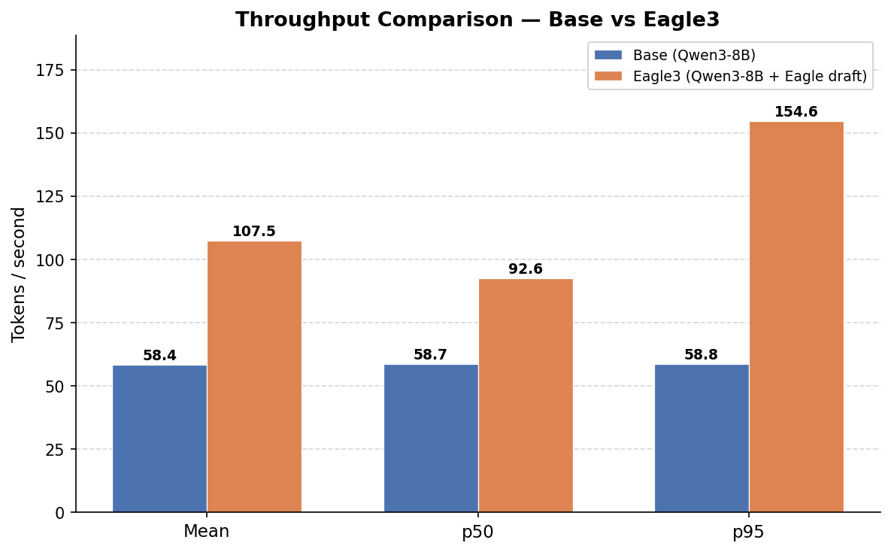
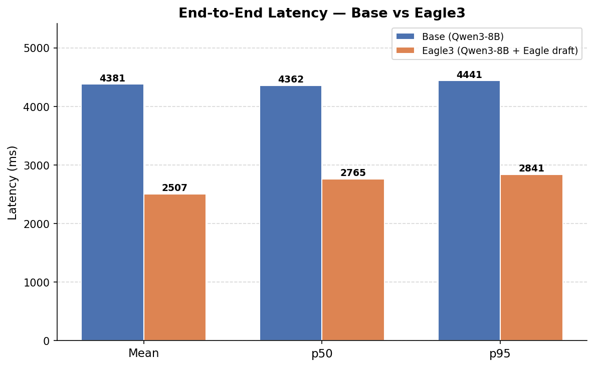
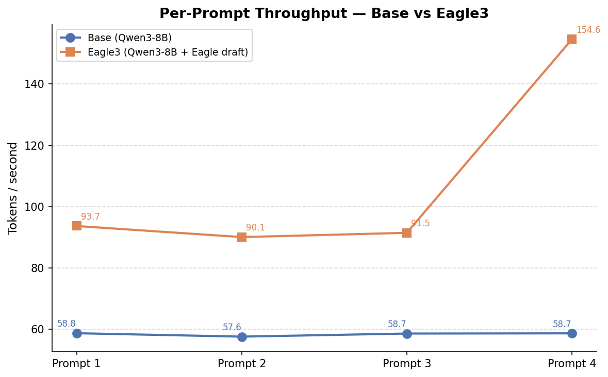
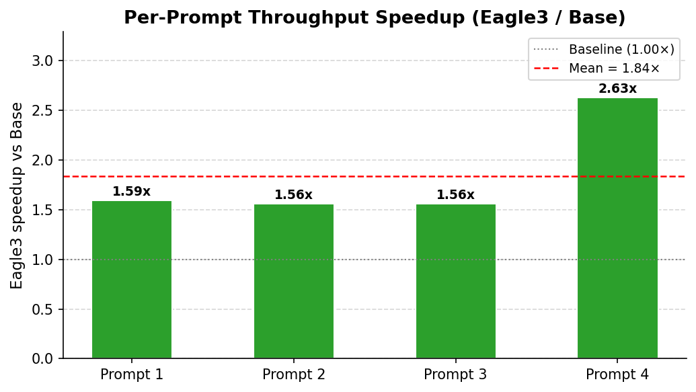
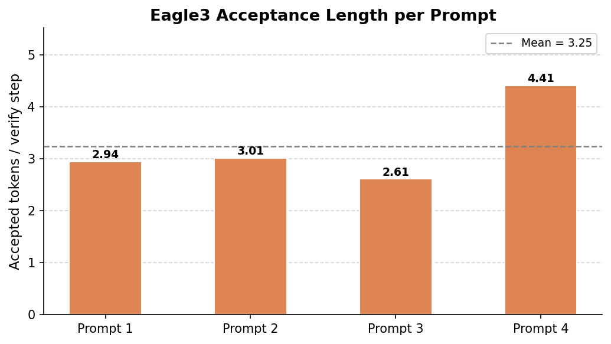

# Qwen3-8B Eagle3 Speculative Decoding Benchmark Report

**Date:** 2026-04-25 07:49  
**GPU:** NVIDIA GeForce RTX 4090 (24 GB)  
**Framework:** SGLang 0.5.2  
**PyTorch:** 2.8.0+cu128  

---

## 1. Setup

| Parameter | Value |
|---|---|
| Base model | `Qwen/Qwen3-8B` |
| Draft model | `Tengyunw/qwen3_8b_eagle3` |
| Speculative algorithm | `EAGLE3` |
| Speculative steps | 6 |
| Eagle topk | 10 |
| Max draft tokens | 32 |
| Max new tokens | 256 |
| Temperature | 0.0 |
| dtype | bfloat16 |
| mem_fraction_static | 0.72 |
| Prompts evaluated | 4 |

---

## 2. Results Summary

| Metric | Base | Eagle3 | Delta |
|---|---|---|---|
| **Mean throughput (tok/s)** | 58.44 | **107.47** | +49.03 |
| **p50 throughput (tok/s)** | 58.68 | **92.60** | — |
| **p95 throughput (tok/s)** | 58.76 | **154.59** | — |
| **Mean latency (ms)** | 4381 | **2507** | -1874 ms |
| **p50 latency (ms)** | 4362 | **2765** | — |
| **p95 latency (ms)** | 4441 | **2841** | — |
| **Throughput speedup** | 1.00× | **1.84×** | — |
| **Latency reduction** | 1.00× | **1.75×** | — |
| **Mean acceptance length** | — | **3.25 tok/verify** | — |
| **Mean spec verify count** | — | 82 | — |

> Eagle3 delivers a **1.84× throughput speedup** and reduces mean end-to-end latency by
> **1874 ms** (43%) compared to standard autoregressive decoding.

---

## 3. Charts

### 3.1 Throughput Comparison



Mean, median (p50), and 95th-percentile tokens-per-second for Base and Eagle3.
Eagle3 raises mean throughput from **58.4** to **107.5 tok/s**.

---

### 3.2 End-to-End Latency



Eagle3 cuts mean latency from **4381 ms** to **2507 ms** —
a **43% reduction** for 256-token outputs.

---

### 3.3 Per-Prompt Throughput



Eagle3 outperforms the base model on every prompt. Prompt 4 benefits most
(**154.6 tok/s** vs **58.7 tok/s**), likely due to high
token repetitiveness (acceptance length **4.41**).

---

### 3.4 Per-Prompt Throughput Speedup



All four prompts show super-linear improvement. The mean speedup is **1.84×**
with a maximum of **2.63×**.

---

### 3.5 Eagle3 Acceptance Length



Acceptance length measures how many draft tokens are accepted on average per
verification step (higher is better). The mean across prompts is **3.25**,
meaning Eagle3 produces ~3.2 output tokens for every forward pass
of the target model.

---

## 4. Per-Prompt Detail

| Prompt | Length | Base tok/s | Eagle tok/s | Speedup | Acceptance len | Spec verify ct |
|---|---|---|---|---|---|---|
| 1 | 321 | 58.76 | 93.70 | 1.59× | 2.94 | 87 |
| 2 | 337 | 57.65 | 90.11 | 1.56× | 3.01 | 85 |
| 3 | 290 | 58.65 | 91.50 | 1.56× | 2.61 | 98 |
| 4 | 290 | 58.72 | 154.59 | 2.63× | 4.41 | 58 |

---

## 5. How to Reproduce

```bash
# From repo root
.venv/bin/python speculative-decoding/sglang_eagle_benchmark.py \
  --base-model-path  models/Qwen3-8B \
  --eagle-model-path models/qwen3_8b_eagle3 \
  --max-new-tokens   256 \
  --prompt-count     4 \
  --port             31000 \
  --mem-fraction-static 0.72
```

Then re-run this script to regenerate the report:

```bash
.venv/bin/python speculative-decoding/generate_report.py
```

---

## 6. Notes

- `ttft_ms` (time-to-first-token) was not returned by this SGLang version and is absent from all rows.
- Eagle3 requires the `Tengyunw/qwen3_8b_eagle3` draft head, which was trained on Qwen3-8B
  using the Eagle3 method on 600 K samples / 1 B tokens of UltraChat-200K.
- The draft model adds ~764 MB of VRAM overhead (vs 15.7 GB for the base model weights).
- Both models were served sequentially on a single RTX 4090 with `mem_fraction_static=0.72`
  to leave adequate GPU memory for the Eagle run's combined base + draft allocation.
